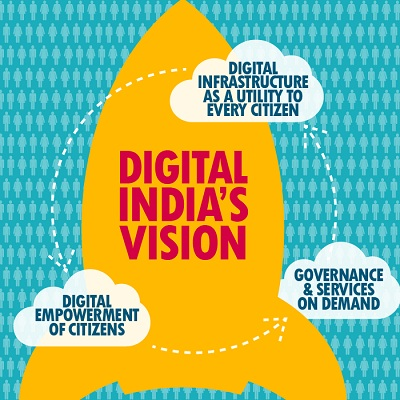

```{r setup, include=FALSE}
knitr::opts_chunk$set(echo = TRUE)
```
# Areas to analyse
**infrastructure policies** with a focus on
* infrastructure sharing
* effective regulation for competition
* spectrum policy
* bb policy

**access** with a focus on
* use of USAFs
* PAS
  + Look up Digital Village. Apparently Govt is rolling out free public wifi across 1050 villages in India. (is that a big number assuming there are 625k of villages in India?)
  + Look up [Wireless for Communities](http://wforc.in/)


# Notes for final report
[Digital India](http://digitalindia.gov.in/content/programme-pillars) (DI) has three key areas:
1. digital infrastructure as a utility to every citizen
2. governance & services on demand
3. digital empowerment of citizens



Key pillars of DI to consider:
* [bb highways](http://digitalindia.gov.in/content/broadband-highways) ubiquitous connectivity
* [universal access](http://digitalindia.gov.in/content/universal-access-mobile-connectivity) to mobile connectivity
* [public Internet access programme](http://digitalindia.gov.in/content/public-internet-access-programme)
* [Early harvest programmes](http://digitalindia.gov.in/content/early-harvest-programmes) - these are to be implemented within a short timeframe
  + Public wifi hotspots - cities with a pop^n^ of 1M & tourist centres would be provided with public wi-fi hotspots
  + Wifi in all unis on the National Knowledge Network (NKN)
* Other projects:
  + __Bharat Net__ - high speed digital highway to connect all 2.5 lakh Gram Panchayats. World's largest rural broadband (bb) connectivity project using optical fibre. Look at __BBNL - [Bharat Broadband Network Ltd](http://www.bbnl.nic.in/index.aspx)__
  + BSNL's __Next Generation Network (NGN)__ - modernise
  + BSNL's Wi-Fi hotspots throughout the country


DI project is __coordinated by DeitY__ in collaboration with various Central Ministries/Departments and State Govts
__PM__ is the chairman of the monitoring committee on DI
All existing ongoing e-Gov initiatives have been revamped to align with the principles of DI

#### Look up initiatives by DoT
1. Bharatnet in 11 states
2. Wi-Fi Hot spots
3. Next Generation Networks (NGN)
  * Look-up specifically C-DOT's launches like
    + long distance Wi-Fi
    + solar powered Wifi system

#### Impact
By 2019 DI would achieve the  following (to confirm):
* broadband connectivity in all Panchayats
* wifi in schools and unis
* Publich wifi hotspots

#### Other important things
Open Sky Policy to use satellites to provide connectivity in remote areas. Is satellite tech feasible/affordable? Apparently National Telecom Policy 2012 talks about open sky policy. Need to simplify the process and reduce procedural delays in securing satellite bandwidth through a single window approach.

MF Farooqui (Broadband India Chairman and former telecoms secy) believes that bb in India will have to be delivered by using multiple technologies and satellite tech should play it's part in delivering bb to remote areas.

### Notes from CIS-Telecom-Blogs
_These notes are from blog posts relevant to telecom and go back all the way to May, 2011._

[Blog date: 5-May-2011](https://cis-india.org/telecom/blog/spectrum-reforms)
Spectrum Trading means exclusive rights to spectrum
Spectrum Sharing means exactly what it implies
Currently Spectrum Trading and Spectrum Sharing are mutually exclusive in India. Spectrum is currently sold with exclusive right to the telecom provider. It is based on old technology (60-70 years old) which assumes that there has not been any progress in managing intereference between providers. Spectrum trading constrains aggregate capacity in two ways:
1. Each operator can only use part of the allotted capacity - i.e., spectum capacity by providers is hardly ever utilised beyond 5% ([source](http://goo.gl/qVyBv))
2. large band provides much greater capacity than the sum of smaller bands

Forward looking spectrum policies need to understand technicalities of spectrum occupancy, of the effects of spectrum aggregation versus fragmentation, and of technologies like multiple antenna effects (multiple-input and multiple-output, or MIMO), which enable efficient use of spectrum and improve functional attributes of higher freq.

[Blog date: 3-Aug-2017](http://organizing-india.blogspot.co.uk/2017/08/a-new-telecom-policy-that-works.html)
Telco operators debt is Rs.4.6 trillion. This is due to aggressive bids for spectrum auctions. Aggravated by shrinking revenues and price wars. There is need for network investment, greater reach and delivery but can't be accomplished because of "want of capital, enabling policies, and orderly markets". Safe to say Indian telco sector is in a state of crisis.

[Blog date: 31-Jan-2017](https://cis-india.org/telecom/blog/business-standard-january-31-2017-and-organizing-india-blogspot-february-1-2017-shyam-ponappa-a-pathfinding-approach-for-digital-india)
**On Optical Fibre Cable (OFC)** _"Most people believe an optical fibre cable (OFC) connection is necessary for broadband. While largely true, this is often financially viable only in urban agglomerations. What is less known is that trading companies use wireless links between New York and Chicago for high-speed electronic trades.[1] For people outside urban clusters, wireless is a less expensive alternative to fibre. They get only a few megabits per second, but realistically, ubiquitous broadband at 2 Mbps would be great."_ This puts into perspective that a bb policy can only have a limited impact. It is much faster and better to focus on wireless policy to reach remote and rural areas.

OFC isn't ideal for remote areas as costs are too high, especially in hilly terrain. Estimates of cost of laying OFC vary between Rs.1 lakh to Rs.4 lakh per km. Another challenge with OFC is the number of cuts per km per month. Average number of cuts per km per month in India is between 12-14 while international benchmark is 0.7. This requires frequent repairs.
Also, wireless technology is needed to extend connectivity from the fibre to villages, and cellular network costs rise with less bandwidth. For instance, one estimate is that excluding spectrum costs, a network using 5 MHz costs nearly 70 percent more than using 20 MHz.

Therefore, there are limits to how much we can rely on OFC for universal access. It's good for urban agglomeration but not for rural.
Several proven wireless technologies are not permitted in India, although the Telecom Regulatory Authority of India has recommended their use. Methods to increase connectivity like those listed below are urgently needed, with requisite environmental safeguards such as the use of renewable energy.
* 60 GHz (V band) wireless gigabit for short-haul;
* 70 and 80 GHz (E band) for multi-gigabit backhaul up to 5 km;
* TV White Space for the middle mile from the fibre to users in villages up to 8-10 km away in a single hop;

Additional steps, e.g.:
* Increasing unlicensed spectrum in the 5.8 GHz band from 50 MHz to 80 MHz to enable 866 Mbps per channel, or more for gigabit capacity;
* Enabling secondary sharing of spectrum bands such as TV White Space, which has the possibility of existing Indian IPR establishing domestic manufacturing and dominating this niche;

Additional note on current connectivity in India - [here](https://yourstory.com/2017/08/indian-smartphone-poor-internet/)

Remaining blog posts to read

[Blog1](https://cis-india.org/telecom/blog/cis-submission-trai-note-on-interoperable-scalable-public-wifi)
[Blog2](https://cis-india.org/telecom/blog/business-standard-september-1-2016-shyam-ponappa-digital-india-needs-these-policy-changes)
[Blog3](https://cis-india.org/telecom/blog/cis-submission-to-trai-consultation-on-proliferation-of-broadband-through-public-wifi-networks)
[Blog4](https://cis-india.org/telecom/blog/business-standard-april-6-2016-shyam-ponappa-breakthroughs-needed-for-digital-india)
[Blog5](https://cis-india.org/telecom/blog/business-standard-october-1-2015-shyam-ponappa-digital-india-now-to-work)
[Blog6](https://cis-india.org/telecom/blog/comments-on-dot-panel-report-via-mygov)
[Blog7](https://cis-india.org/telecom/blog/funding-of-national-optic-fibre-network-who-is-accountable)
[Blog8](https://cis-india.org/telecom/blog/organizing-india-blogspot-shyam-ponappa-june-4-2015-unfettering-stranded-capacity)
[Blog9](https://cis-india.org/telecom/blog/business-standard-op-ed-may-6-2015-shyam-ponappa-stranded-capacities-and-greater-expectations)
[Blog10](https://cis-india.org/telecom/blog/organizing-india-blogspot-shyam-ponappa-december-4-2014-a-roadmap-for-digital-india)
[Blog11](https://cis-india.org/telecom/blog/otts-eating-into-our-revenue-telcos-in-india)
[Blog12](https://cis-india.org/telecom/blog/organizing-india-blogspot-shyam-ponappa-may-1-2014-an-infrastructure-road-map)
[Blog13](https://cis-india.org/telecom/blog/an-introduction-to-spectrum-sharing)
[Blog14](https://cis-india.org/telecom/blog/organizing-india-blogspot-shyam-ponappa-centre-or-state-driven-development)
[Blog15](https://cis-india.org/telecom/blog/organizing-india-blogspot-december-5-2013-shyam-ponappa-for-a-telecom-revival)
[Blog16](https://cis-india.org/telecom/blog/trai-consultation-paper-on-spectrum)


# Spectrum challenges in India
[Source - Brookings Institute Research](https://www.brookings.edu/wp-content/uploads/2016/06/Spectrum-Policy-in-India8515.pdf)

1. Lack of available spectrum
Insufficient spectrum bands available. Other countries (developed and developing) have many more licensed spectrum bands available. While low numbers is itself a problem another problem in India is that on average the amount of spectrum per band is also small, 13MHz on average. It is even lower than Bangladesh (37.4 MHz) and Malaysia (75 MHz)


Country | Current | Pipeline | Hz/Subscriber
--------| --------| ---------| -------------
USA     |  608    | 55       |  2.1
Austrailia  | 478  | 230   |  22.8
Brazil  | 554   | 0   | 2.0
China  | 227  |  360 | 0.5
U.K  | 353  | 265  | 7.9
India  | 221  | 10  |  0.2

  - One reason for shortage is also that Government departments and defense have held large amounts of spectrum making it unavailable for commercial use.
  - Spectrum sharing has now been approved by the government. Companies can now share unutilised spectrum with other operators for a period of 5 years, for a fee.


2. High costs
Analysts have documented that "spectrum cost in India is one of the highest in the world.". Its spectrum pricing runs around “25 times costlier than the countries such as U.S., France, Singapore, Germany, Spain and Sweden.” Business leaders complain that spectrum is scarce, fragmented, overpriced, and inflexible. By having licenses that run just for 20 years, government policies force firms into expensive infrastructure investments without sufficient time to reap the financial rewards of those costs.

3. New technologies and the use of unlicensed spectrum:
Emerging technologies require greater access to and usage of spectrum. With the rollout of 4G LTE services, LTE-U (unlicensed) is an innovation that is being worked on in other regions. It is an improvement the Indian government should maintain awareness of as it works to provide increased coverage and capacity in addition to seamless mobility. This technology will work in coordination and within the same unlicensed bands as “Wi-Fi”. Greater use of unlicensed spectrum could be helpful to businesses and consumers. One step to improve wireless access is through the parts of the radio waves having no exclusive licenses. Users can operate Wi-Fi devices over short distances and gain access to particular services at an affordable price. In the developing world, this is a valuable way to provide affordable services for poor people and help them utilize digital products


# Notes from Internet Society report (community networks)

- Spectrum challenges from POV of enabling community networks
- Spectrum challenges from POV of making it easy for operators to serve these areas (spectrum sharing, spectrum sub-licensing)

1. From Community Networks' POV
- spectrum scarcity
- inefficient use of spectrum
  - exclusive licenses (traditional licensing)
  - broad licenses (exclusive license to a large geographic area with little or no economic incentive to provide service to all)
- Access to spectrum is expensive

Some solutions:
 - access to unlicensed spectrum
   - e.g. W4C by DEF
   - e.g. Pamoja Net in Democratic Republic of Congo
   - e.g. Chancay-Huaral Project in Peru
 - sharing licensed spectrum or dynamic spectrum access
   - things like Television White Spaces (TVWS)
   - e.g. Citizen Connect in Namibia, Project Kgolagano in Botswana
   - e.g. TVWS Experimental Licenses in India - gov issued 8 experimental licenses in the 470-582 MHz band
   - e.g. Citizens Band Radio Service in US where spectrum currently occupied by Department of Defense is shared on a secondary and tertiary basis, by licensed users and lightly-licensed users
 - Innovative approach to licensing & spectrum mgt e.g., "social purpose license" at a much lower spectrum fee
    - e.g. India: Supreme Court decided that "spectrum such as TVWS or 5 GHz spectrum, could be allocated on a license-exempt or unlicensed basis as long as such a policy is 'backed by a social or welfare purpose' such a susing connectivity to increase social and economic inclusion"
    - e.g. Mexico - has set aside some spectrum for social purpose use. The community served must be < 2,500 people, or be an indigenous region or otherwise designated for such use.

# Notes from CIS-India Report on Unlicensed Spectrum
_This report also provids a comparative analysis of policy on unlicensed spectrum by various countries_

One legacy concern around which most spectrum policies have been built is of interference. This is understandable because the earliest use case of use of spectrum was for mission critical long range services and one couldn't afford interference in such a scenario however, technology has evolved to counter that problem (OFDMA, Spread Spectrum Frequency Hopping, BDMA, FMC, ultra wide band (UWB), etc.) These technonology innovations facilitate spectrum sharing and enabling spectrum signals to coexist with each other w/o interference.

**"RF spectrum allocation is harmonized on an international level through the Radiocommunication Sector within the International Telecommunication Union (ITU)."**

1.4 The Indian Department of Telecommunications (DoT) requires operators to obtain a licence before being granted the right to use radio spectrum. There are exceptions to this rule, such as the Citizens Band in the 27 MHz range and the Wi-Fi bands in the 2.4 GHz and 5.8 GHz ranges. **India‟s National Telecom Policy 2012 recognizes the need to reserve more frequencies for unlicensed use.** However, the country is still behind when compared to unlicensed spectrum availability in the U.S. and UK which have already integrated innovative spectrum management techniques in their telecom policies. These policies aim to create a flexible, market-driven approach to spectrum regulation and management through integrating spectrum sharing techniques and meeting the industry demand for unlicensed spectrum. India needs to follow suit in order to provide connectivity to remote/rural regions and encourage further innovation in the telecom domain. Therefore, additional frequencies should be freed up for unlicensed use according to demands from community groups, industry bodies, and experts in the field, in line with international best practices.

According to ITU, at the WRC in 2003, 5-6 GHz range was made unlicensed. US, UK and Canada have done that. India has done so partially.

IMPORTANT POINTS FROM ITU:
- "According to the ITU, both vision and commitment are needed when implementing policies for spectrum unlicensing, which result in the most efficient and optimum sharing of the resource. Spectrum policies should motivate innovation, be flexible, and set out spectrum users‟ rights"
- " there should be a framework for compliance monitoring as well as dispute resolution"

### Indian perspective on spectrum allocation and unlicensing of spectrum  
Supreme Court declared airwaves to be a public property (1995). Presently, a large part of RF spectrum is controlled by the govt. with only a minimal amount for unlicensed use, but there is a growing recognition of the importance of allocating more unlicensed spectrum. Look at table A in the [report](https://cis-india.org/telecom/unlicensed-spectrum-brief.pdf) to see the unlicensed allocation.

They are mostly for low power indoor use with some minor exceptions. This was done because controlling such indoor use was impractical.

- It is consensual among Google, Microsoft, and the Internet Service Provider’s Association of India (ISPAI) that additional frequencies need to be unlicensed for broadband access
  One of the reasons for this request is that the existing 50 MHz of licence-exempt spectrum in the 5.7 GHz band has become choked up as many ISPs switch to providing services using these unlicensed frequencies. The situation is the same in the case of the 2.4 GHz band, which has become overloaded due to the unavailability of more unlicensed spectrum
