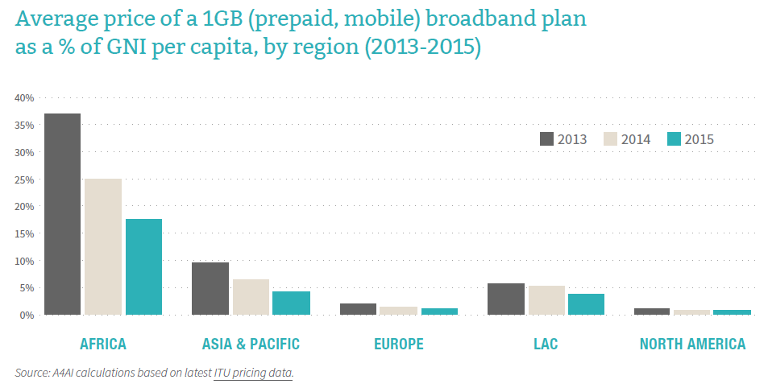
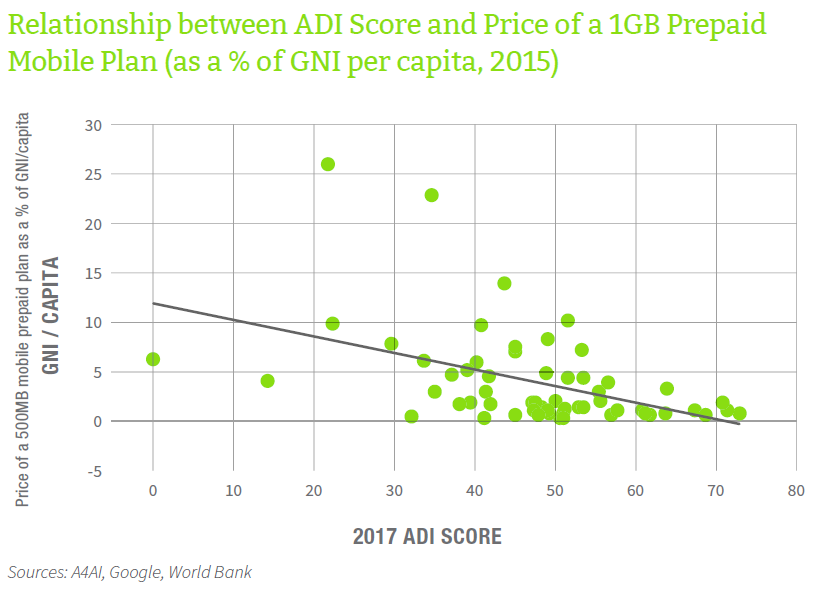

Notes on universal access to broadband Internet
================

Notes from 2017 Affordability Report by A4AI
--------------------------------------------

The report can be found [here](def/universal-access/background-research/A4AI-2017-Affordability-Report.pdf).

Report covers 58 low-mid income countries and tracks progress made towards:

-   drive Internet prices down
-   expand access

As per UN Sustainable Development Goals, target for [universal access](http://www.un.org/sustainabledevelopment/infrastructure-industrialization/) has been set as 2020 but with current rate of progress we will achieve it by 2042. 4Bn people are offline today (50% global Internet penetration), most of them women, and most of them in developing countries. Main reason: *cannot **afford** to connect*. Broadband prices are coming down but not fast enough.

Another problem: policy isn't changing fast enough. Report recommends *'smart'* policy changes that encourage **competition** and **innovation** in key areas, such as **spectrum**, **infrastructure** and **lasts-mile connectivity**. The rule of thumb pricing guideline is "1 for 2" (1f2) - 1 GB data for no more than 2% of income. Only 19 of 58 countries have met this "1 for 2" target.

Six specific policy suggestions of the report:
1. Employ public access solutions (PAS) to close digital divide (DD)
2. Foster market competition through policy
3. Implement innovative uses of spectrum through transparent policy - e.g. support community networks or invest in developing new technology
4. Take urgent action to promote infrastructure and resource sharing
5. Make good use of Universal Service and Access Funds (USAFs)
6. Ensure effective bradband (bb) planning turns into effective implementation

Current status of affordability
-------------------------------

Standard assumption used to be that 500Mb of internet should be available for 5% of income but that doesn't seem too affordable by the poor. The report suggest 1f2 and asserts that when prices drop to this level i.e. 2% of income, more income groups (espeically from bottom 20%) can afford to connect. Report also claims it is easy to achieve this by small but smart policy changes. It requires innovation in key areas, viz. spectrum, infrastructure, and last-mile rural connectivity. For those at base of pyramid, PAS will help.
India (1GB @ 3.55% of GNI/capita) does not meet 1f2 requirement. But following countries do - Sri Lanka (0.48%), Kazakhstan (0.56%), China (0.70%), Pakistan (2.07%). India is just a tad better than Bangladesh (3.63%).

-   only 50% countries have policies to support PAS. **check if India has a policy and if it is backed by financial support**
-   only 45% have plans to reduce costs by facilitating resource sharing (e.g. sharing of towers or fibre networks). **check if India has**
-   1/3 has detailed, time-bound plan for making more spectrum available **check if India has**
-   1/3 doesn't have USAF or its dormant **check status for India**
-   national broadband policy plans are either dormant or out of date in 41% of countries surveyed

Policy and regulatory steps that can increase affordability
-----------------------------------------------------------

The Affordability Drivers Index (ADI) assesses the extent to which countries have implemented a number of factors that can lower the overall cost structure for broadband (i.e., affordability drivers).

#### How does ADI work?

The ADI does not measure actual broadband prices, nor does it tell us how affordable broadband is in a given country. Instead, it scores countries across two main policy groups: (1) **infrastructure** (i.e., the extent to which ICT infrastructure has been deployed as well as the policy framework in place to encourage future infrastructure expansion); and (2) **access** (i.e., current broadband adoption rates as well as the policy framework in place to enable equitable access).

Each country is awarded a score (out of 100) across a range of variables within each grouping, and is then ranked against the other countries in the ADI. Higher scores indicate the existence of a combination of factors which contribute to lower the cost structure for broadband provision and eventually lower prices.

High ADI scores are correlated with reduced broadband costs — both for industry and for consumers. As highlighted in the figure below, there is a negative and statistically significant correlation between the ADI score and the price of 1GB mobile prepaid data plan.

Here is the actual ranking of countries based on their ADI score in 2017. India is 35th, below Pakistan and Sri Lanka.

Colombia (rank 1, second consecutive year) has launched an expansion of access plan to serve under-served areas through programmes such as the [Plan Vive Digital](http://www.mintic.gov.co/portal/vivedigital/612/w3-channel.html). Colombia also subsidises the cost of both data and devices for those living in poverty and those who have never been online before.

PAS
---

While PAS is at times considered a 'transition' solution for connectivity for the poorest it is not a transition but their oinly means of getting connected and is likely to remain for a long time. Even after affordability targets have been achieved many countries continue to invest in expanding their PAS because they believe it is essential to ensure more and more people participate equally in civic life.

Public access facilities also often offer educational programmes like digital skills training, which in turn can promote local content development, and can stimulate greater demand for online services.

Main point of this section is that Public Access Solutions remain underutilised and potential untapped. Check if:
\* what is country actually doing to increase PAS?
\* how many specific public policies are in place to promote low-cost public internet access (e.g., budget allocations for internet in public libraries, community centres, or provisions for spectrum use by community WiFi options)
\* is there a specific reference to PAS in the country's broadband policy?

Some of the things that Colombia and Turkey have done are:
1. created PAS in rural communities
2. provide ICT devices and broadband internet access to schools
3. digital skills training
4. provision of public WiFi hotspots by using USAF

Public WiFi is a major opportunity. See chart below:

Govertnments are betting big on public WiFi. In India, the government recently announced its intention to roll out free public WiFi to over 1050 villages across the country, as part of its **Digital Village** programme. Each village will have a WiFi hotspot installed, which villagers can access using their mobile phones.

Another PAS option is **community networks**. India, with its [**Wireless for Communities**](http://wforc.in/) programme offers interesting examples of an initiative working actively to address the sustainability challenge of running these community networks.

Reccomended policies to implement 1f2
-------------------------------------

-   no single strategy
-   for any PAS strategy there needs to be complementary & supportive policy environment in place
    -   e.g., reserving spectrum for community networks requires a strong spectrum policy & management regime
    -   e.g., using USAFs requires policy framework to support and manage the fund
-   PAS strategies must be approached as part of --- and in coordination with --- a cohesive broadband strategy

Five major **policy themes** have been identified which help in driving down cost of broadband:
1. Effective policies and regulation for competition
2. Detailed and efficient broadband strategies
3. Cohesive spectrum policy and access to spectrum
4. Infrastructure and resource sharing
5. Policies to support Universal Service Access Funds (USAFs) and public access

India is classified as a **USAF - inactive (or no funds disbursed)** country.

**Further research - What is India's broadband policy?**
